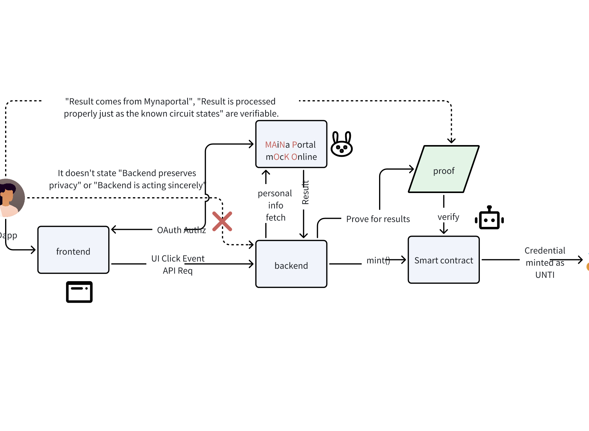
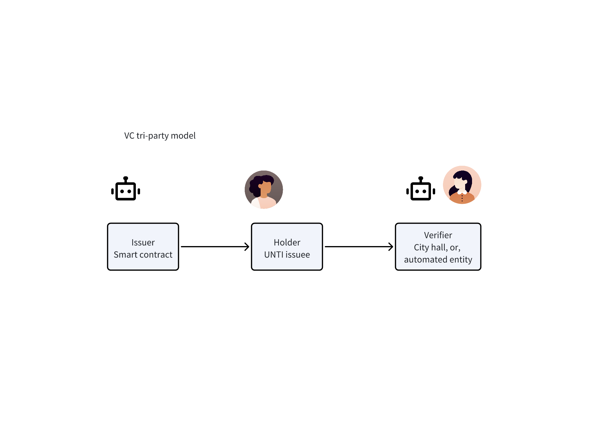

# Usagi Verify

<div align="center">
  
</div>

## ショートディスクリプション

Usagi Verify は、ZK（ゼロ知識証明）を活用して、現実世界の公的情報(日本だとマイナンバー等)を秘匿性を保ちながらブロックチェーン上で検証・活用できるようにするプロダクトです。

## ディスクリプション

Usagi Verify は、ZK（ゼロ知識証明）を活用して、政府が管理するマイナポータルの情報をもとに、ワクチン接種証明や医療費情報、検診情報などを NFT として発行し、透明性とプライバシーを両立した新しいデジタル証明の形を提供します。

例えば次のような NFT を発行できます。

- ワクチン接種履歴 NFT

  COVID-19 などのワクチン接種記録を NFT としてブロックチェーン上に記録。

  従来の対面での証明に頼らず、秘匿性を保ちながらオンチェーンで検証可能な証明書を実現。

- 医療費 NFT

  医療費情報をティア（階層）に分け、NFT として発行。

  医療費控除スマートコントラクトで検証可能にし、控除還付として JPYC などのインセンティブを受け取れる仕組みを作り出す。

- 健康 NFT

  健康診断情報をティアに分けて NFT として発行。

  所得情報と同様に、健康な人ほど特典を受けられる仕組みを作りだす。

## どのように作ったか

- フロントエンド：
  ユーザーが認証や NFT の発行・管理を行うインターフェース。公的情報基盤への認証と情報取得、ZK Proof の作成、NFT の発行・確認までが行える。Next.js と TypeScript を利用して実装

- バックエンド：
  マイナポータルを模した機能を実装し、健康情報や所得情報が取得できるようなロジックを実装。ZK proof の作成や検証を行うためのロジックやスマートコントラクトの機能を実行するための API を実装。Hono を利用して実装。

- ZK サーキット：
  ゼロ知識証明を活用し、個人情報を秘匿したままオンチェーンで検証可能なデータを作成する。ZK サーキットは、 succinct の機能を利用して実装。

- スマートコントラクト：
  ERC6268 を継承した NFT の発行・管理、検証ロジックを実装。ZK による検証が完了したらクレデンシャルとして UNTI がミントされる。hardhat と OpenZeppelin を利用して実装。

## アーキテクチャ図





## リポジトリの構成

このプロジェクトのソースコードは、 npm workspace を利用したモノレポ構成で管理されています。

```bash
.
├── README.md
├── README_ja.md
├── assets              画像データなどを保管したフォルダ
├── backend             API関連のソースコードを格納したフォルダ
├── circuits            ZKサーキット関連のソースコードを格納したフォルダ
├── contract            スマートコントラクト関連のソースコードを格納したフォルダ
├── frontend            フロントエンド関連のソースコードを格納したフォルダ
├── infrastructure      インフラ関連のソースコードを格納したフォルダ
├── package-lock.json
└── package.json
```

## 使った技術スタック

- フロントエンド系
  - Prettier
  - Next.js (page router)
  - Plasmic
  - Tailwind CSS
  - Jotai
  - TypeScript
  - Cloudflare Pages
- バックエンド系
  - Hono
  - TypeScript
  - Node.js
  - node:crypto
- スマートコントラクト系
  - Hardhat
  - Solidity
  - TypeScript
  - Infura
  - viem
  - ethereum sepolia
  - ERC6268
  - ERC1155
  - ERC165
  - OpenZeppelin
- インフラ系
- ZK 系
  - succinct
  - Rust
